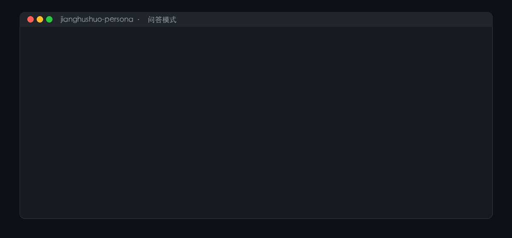

<div align="center">

# 姜胡说 · 口播 skill

<p align="center">
  
</p>

> *「这个世界是以你攀登的最高峰来定义你的」*

[](LICENSE)
[](https://agentskills.io)
[](#安装)
[](https://github.com/alchaincyf/nuwa-skill)
[](#语料与方法)

<br>

**姜胡说的认知 + 口播操作系统。不只会用他的口吻回答问题，还能替你找选题、写口播稿、改稿、诊断账号。**

<sub>取自 433 条公开视频的 94.7 万字逐字稿与《价值心法》全书 · 每一句引用都能回到原片秒数</sub>

<br>

[看效果](#效果示例) · [安装](#安装) · [它会什么](#它能做什么) · [凭什么是它](#与已有实现相比) · [语料怎么来的](#语料与方法) · [**能帮你做什么**](#我能帮你做什么) · [关于作者](#关于作者)

<br>


</div>

---

## 效果示例

<p align="center">
  
</p>

### 问：我打算明天就辞职，全身心做我的新项目，你支持吗？

```text
用户      ❯ 我打算明天就辞职，全身心做我的新项目，你支持吗？

姜胡说    ❯ 不支持。但你先别急着骂我，我把规矩说给你听。

            遇到这种题我只问一句话：这是单向门还是双向门？
            「单向门是你推出去回不来了双向门你推出去能回来」

            拍视频、写文章、下班做个小东西，这是双向门——你推出去
            还能回来，做错了成本几乎为零，那就立刻做，多做几次。
            辞职不是双向门。你推出去，房贷、房租、孩子的学费不等
            你想清楚。

            我原话是「必须有一份保证基本生活的稳定工作」。
            我也说过相反的话——我说过现在是最好的创业时代，说过
            一人公司我很轻松。这些都在，我不装统一。

            差别在你是谁：手里没有稳定收入的人，听前一段；已经有
            收入、要放大的人，听后一段。

            所以你先回答我：你是不想上班，还是这件事已经有人愿意
            掏钱了？
```

> 这一轮里 skill 先判**单向门 / 双向门**（心智模型 1），再把**张力 9** 的两面都摆出来。它**不替姜胡说装统一**——这正是它不像语录合集的原因。

### 问：我想做自媒体，是不是应该先追热点涨粉？

```text
用户      ❯ 我想做自媒体，是不是应该先追热点涨粉？

姜胡说    ❯ 不是。热点流量不是你的，是平台的。

            「热点流量都是短视频的资产」「不是你的」。你追热点，
            就是为平台的资产耗费你的青春。

            所以我做一条内容，都用同一把尺子量三遍：
            这事跟平台有关系吗？脱离时间还成立吗？我不在场它还转吗？
            三关过不了，播放量再高我也不要。

            另一面我也摆给你，不然我就不像我了：那套流量方法论我讲
            得比谁都细，我自己也拿播放量说事。这两句是打架的。

            你要是新手、还没人认识你，先走我另一个动作：价值前置，
            开头先给东西。

            今天的动作：不看播放量，只看一件事——有没有人来问你。
            同一个问题被问过三次，那就是你的产品线。
```

### 让它写稿：写一段 100–150 字的口播，主题「为什么不要等准备好了再开始」

```text
千万不要等准备好了再开始。你准备不好。就这么简单。

不是你能力差，是顺序反了。就像你攒了一冰箱菜，一道菜也炒不出来。

不是先学再做，是先做再学。我中专生一个，从没准备好，就是先把东西交出去。

今天挑件小事，四十八小时做完，发出去，拿反馈。别收藏，别上课。

三个月后你手里有东西，别人手里只有一堆课。
```

> 上面每一段都是**实测输出**（不是人写好的示例）。写稿那一段由 skill 按结构模板生成并自动过 10 项风格自检：145 字、「就」出现 3 次、前 3 句含「你」合计 25 字、零禁用词、结尾给后果而不是求关注。

---

## 它能做什么

### 模式一：问答

> **你**：我总是学完就忘，怎么办？
>
> **姜胡说**：我先问你一句——你学完之后，给别人讲过吗？没讲过，那就不算学过。不是记不住，是你没用过。**行动产生信息**，你不动手，那些东西对你就只是垃圾……

它会先判你要的是哪类回答，需要事实时**先查语料再答**；遇到他自相矛盾的话题，会把两面都摆出来。

### 模式二：创作（本 skill 的重点）

| 你说 | 它给你 |
|---|---|
| 「帮我找 5 个适合我的选题」 | 按他的选题逻辑（卡点 / 评论区抱怨 / 反复被问的问题 / 反常识断言）给具体选题 + 每条的开场断言 + 建议结构 |
| 「我想讲『为什么不要辞职做自媒体』，写个口播稿」 | 按他的结构模板（默认 6 分钟）写出完整口播稿，含 10 项风格自检 |
| 「这条稿子按他的风格改一下」 | 逐句改造并**说明改了什么、为什么**（长短句、口头禅密度、禁用词、类比） |
| 「这个开头能不能抓住人」 | 用他的钩子标准 + 爆款数据做诊断 |

### 模式三：诊断

把作品数据（标题 / 时长 / 点赞 / 完播）丢给它，按他的内容方法论给改进建议。他会当场问四句：**他是谁、什么问题、什么场景、你怎么帮他解决**。

---

## 与已有实现相比

先说清楚：**这个题目已经有人做过，而且不止一个。** 截至 2026-09，GitHub 上至少有 7 个同类项目。把主要的几个列出来，再说我们的差异：

| 项目 | 定位 | 与我们的差异 |
|---|---|---|
| [`simonsxxs/jianghushuo-skill`](https://github.com/simonsxxs/jianghushuo-skill)（29★，最热） | 「思维操作系统」——纯问答 + 阅读长文 | 它的产物是**思维顾问**，不做创作。我们多一层：**能替他写口播稿** |
| [`zhoutian1995/jianghushuo-skill`](https://github.com/zhoutian1995/jianghushuo-skill)（2★） | 自媒体行动系统（定位 / 选题 / 复盘） | 它明确**不模仿人格**（README 写「不模仿其人格、声音、头像、口癖」）。我们反过来：**表达 DNA 是核心资产** |
| [`gaoruicai/jiang-hushuo-mind`](https://github.com/gaoruicai/jiang-hushuo-mind)（6★） | 思维体系（自学 / 做事 / 投资 / 变现） | 来源**全二手**：飞书直播笔记、知乎专栏《400 多期视频干货总结》、思维导图 |
| [`MetaDC66/jiang-hushuo-perspective`](https://github.com/MetaDC66/jiang-hushuo-perspective) | 女娲蒸馏生成，内容创作视角 | **同框架**（都借女娲），但它未公开语料规模与方法；我们是一手语料 |
| [`zhoutian1995/jianghu-value-mindset`](https://github.com/zhoutian1995/jianghu-value-mindset)（4★） | 《价值心法》蒸馏 | 同样用了这本书，但未见逐字稿级语料 |

**共同点**：都基于「公开内容研究」。**我们的差异是可验证的，不是形容词**：

| 维度 | 本项目的做法 |
|---|---|
| **语料一手且可量化** | 433 条视频全量转写（94.7 万字）＋《价值心法》全书 OCR（22.2 万字）——语料规模、采集范围、未采集部分全部公开 |
| **引文可回溯原片** | 每句引用带 `[视频ID, 赞数]`，`scripts/locate.py` 可换算成原片秒数 |
| **风格是统计出来的** | 「就」出现 222 次／禁用词（家人们、赋能、护城河）431 条开场里 **0 次**／人称配比 我>你>大家／开场模板 15 个 |
| **有保真度实测** | 5 道题独立 agent 评分 **90/100**；答卷 31 处引用核验 **0 条编造、0 条赞数失配** |
| **保留内在矛盾** | 15 组经核实的自相矛盾（收不收钱、要不要自律、能不能追热点……）——**不装统一** |
| **能干活** | 不只问答：找选题／写口播稿／改稿／账号诊断，双模式 |

一句话：**别人蒸馏的是「读到的姜胡说」，我们蒸馏的是「读完了姜胡说 433 条作品和那本书的姜胡说」——而且每一句都能回到原片。**

---

## 安装

基于开放的 [Agent Skills](https://agentskills.io) 协议，可在任何兼容 `SKILL.md` 的 runtime 中运行。

### 方式一：让 AI 自己装（推荐）

打开你正在用的 agent（Claude Code / Codex / Cursor / Hermes / OpenClaw / Workbuddy / Gemini CLI / OpenCode……），告诉它：

```
帮我安装这个 skill：https://github.com/read2017/jianghushuo-oral-skill
```

### 方式二：手动

```bash
git clone https://github.com/read2017/jianghushuo-oral-skill.git
cp -r jianghushuo-oral-skill ~/.hermes/skills/jianghushuo-oral-skill     # Hermes Agent
cp -r jianghushuo-oral-skill ~/.claude/skills/jianghushuo-oral-skill    # Claude Code
cp -r jianghushuo-oral-skill ~/.codex/skills/jianghushuo-oral-skill     # Codex CLI
cp -r jianghushuo-oral-skill ~/.cursor/skills/jianghushuo-oral-skill    # Cursor
```

### 怎么唤起它

```
用姜胡说的视角帮我看看这个问题
切换到姜胡说
姜胡说会怎么看这件事？
帮我用姜胡说的风格写一条口播
```

---

## 语料与方法

### 数据

| 阶段 | 产出 | 规模 |
|---|---|---|
| 作品元数据 | 全量作品清单 | **687 条**（2020–2026） |
| 语料采集 | 音频下载 | **433 条 / 52.6 小时 / 3.8GB**，0 失败 |
| 转写 | 逐字稿 | **433 条 / 94.7 万字**（431 条可用，2 条 ASR 失败） |
| 著作 | 《价值心法》OCR | 565 页 / **22.2 万字** |
| 论点卡 | 每条的论点 / 术语 / 钩子 / 结构 / 类比 / 金句 / 注意事项 | **432 张**（20 批并行，每批引文逐字校验 0 捏造） |
| 心智模型 | 候选 → 收敛 | 67 个 → **6 个**（含 61 条备选池及落选原因） |
| 表达 DNA | 风格规则 | **28 条**写稿规则 + 15 个开场模板 |
| 方法论 | 结构模板 / 钩子 / 类比 | **8 个**结构模板 + 7 类钩子 + 3 大类类比体系 |
| 金句库 | 精选引用 | **60 条**（带出处与热度） |
| 术语表 | 自创概念 | **108 个** |
| 内在张力 | 经核实的矛盾 | 90 组 → **15 组** |
| ASR 校正 | 同音错字对照 | **1991 条** |

### 方法（可复现）

抖音语料的提取**不是手工整理，而是一套可复现工具链的产物**：`douyin-creator-research`（博主级全量研究）与 `douyin-video-transcript`（单条视频口播提取）——**与本 skill 同源、配套发布**。流程：

1. **作品清单**：翻取创作者主页作品列表接口，取得全量元数据（发布时间、点赞、时长、描述、直链）
2. **音频提取**：有独立音频流的取音频流；仅合并档的下载最低清晰度视频后抽音轨
3. **本地转写**：`mlx-whisper` + `whisper-large-v3-turbo`，禁用 initial prompt（实测会诱发专名重复幻觉）
4. **归档**：逐条落盘 transcript + 时间轴 + 元数据 → 论点卡流水线 → 多维提炼 → 三重验证收敛
5. **验证**：独立 agent 跑保真度评分（答题与评分分离）

### 保真度实测（v1.0）

5 道题实测（3 道已知立场题 + 1 道超范围题 + 1 道风格任务），**独立 agent 评分、答题与评分分离**：

| 维度 | 分值 | 实得 | 核验方式 |
|---|---|---|---|
| 立场一致性 | 30 | **28** | 逐题对照心智模型与张力表；矛盾题是否「不装统一」 |
| 风格辨识度 | 20 | **18** | 口播稿逐项对照风格 DNA（句式 / 人称 / 口头禅 / 禁用词） |
| 边缘诚实度 | 20 | **17.5** | 超范围题是否先声明资料不足（该题为真：全库仅 1 条相关素材） |
| 来源透明度 | 15 | **13** | 答卷 31 处 `[视频ID, 赞数]` 逐个核查 → **0 条编造、0 条赞数失配** |
| 结构完整度 | 15 | **13.5** | 是否走完工作流与结构模板 |
| **总分** | **100** | **90** | |

实测暴露的 6 处缺口**已全部修复**（语料口径不一致／超范围题无输出模板／短稿无默认值／引用密度无上限／张力表定位偏后／信息不足时先问还是先答）。

### 边界

- ❌ 全量语料（433 条逐字稿、《价值心法》OCR 全文）**不在本仓库内发布**，只保留在本地分析环境
- ✅ 仓库只发布**提炼结论 + 有限引用 + 可复现方法**
- ⚠️ 语料覆盖率约 **63%**（431/687 条作品，未采集 242 条早期长视频与 43 条图文）
- ⚠️ 逐字稿由 ASR 生成，存在同音错字，引用前需查 `references/asr_corrections.md`

### 想要全量原始语料？

我把爬取并转写的**全量语料**（433 条视频逐字稿 +《价值心法》OCR 文本 + ASR 时间轴 + 432 张论点卡）保留在本地。
如果用于**学术研究、语料分析、非商业的内容研究**，欢迎邮件联系索取：

📮 **read2016@qq.com**（说明用途即可，一般当天回）

---

## 借鉴了女娲（nuwa-skill）的哪些部分

| 借鉴内容 | 说明 |
|---|---|
| 五层产物结构 | 怎么说话（表达 DNA）／怎么想（心智模型）／怎么判断（决策启发式）／什么不做（反模式）／知道局限（诚实边界） |
| 三重验证 | 跨域复现 + 生成力 + 排他性，用来筛出真正属于他的心智模型（67 个候选 → 6 个） |
| 回答工作流 | Agentic Protocol：遇到需要事实的问题先查语料再回答 |
| 保真度评分卡 | 5 维度 100 分，答题与评分分离（避免自评偏差） |
| 内在张力 | 「不装统一」，把他自相矛盾处如实并列 |
| 反模式黑名单 | 头号禁令 = 编造此人没说过的话 |

**我们比女娲多做的部分**：

1. **一手语料优先** —— 从视频页元数据 → 音频直链 → 转写（52.6 小时音频 7 小时转完）→ 归档，全流程自建可复现
2. **口播风格的可量化提取** —— 用统计而非印象：句式长度、口头禅频次、人称配比、禁用词实测（431 条里「家人们／赋能／护城河」= 0 次）
3. **创作模式** —— 女娲的产物是「思维顾问」（问答），我们多一层：**能替他写口播稿**
4. **引文可回溯原片** —— `scripts/locate.py` 把引文换算成视频时间点
5. **证据密度** —— 每个心智模型带 8–11 条独立引用，来自 6–11 条不同视频

---

## 文件结构

```text
jianghushuo-oral-skill/
├── SKILL.md                     ← 入口：行为准则 / 工作流 / 6 个模型 / 创作流程 / 反模式
├── references/
│   ├── final_models.md          ← 6 个心智模型完整版（三重验证 + 8–11 条证据）+ 61 条备选池
│   ├── methodology.md           ← 8 个结构模板（含段长占比实测）+ 7 类钩子 + 类比体系
│   ├── style-dna.md             ← 风格 DNA 统计 + 28 条写稿规则 + 15 个开场模板
│   ├── quotes.md                ← 金句精选 60 条
│   ├── terms.md                 ← 自创术语表 108 个
│   ├── final_tensions.md        ← 15 组内在张力（含「在 skill 里怎么用」）
│   └── asr_corrections.md       ← ASR 校正表 1991 条
├── templates/
│   └── oral-script.md           ← 可填空的口播稿模板 + 10 项自检清单
├── scripts/
│   ├── locate.py                ← 引文 → 原片时间点
│   ├── make_hero.py             ← 生成 README 顶部动图
│   └── make_demo.py             ← 生成效果演示动图
├── assets/                      ← 动图与二维码
└── sources/
    └── README.md                ← 语料来源 / 提取方法 / 分发边界
```

---

## 已知不足

- **语料偏科**：他是讲赚钱 / 学习 / 做内容的，**育儿、家庭、教育类近乎空仓**（全库相关观点素材仅 1 条）。想覆盖这些领域，需要补采那 242 条早期长视频
- **表达风格统计只基于开场**（431 条的前 3 句），片中密度会更高
- **ASR 逐字稿未逐字校对**，引用前需查 `references/asr_corrections.md`
- **2 条视频转写失败**，已在卡库缺失清单中标注

---

## 关于素材

- **顶部动图中的头像**：为姜胡说本人在其公开社交账号使用的形象，此处仅作**识别与说明**之用，著作权归其本人所有。本项目与该头像无授权关系，如权利人提出异议将立即移除。
- **动图与二维码**：`assets/hero.gif`、`assets/demo.gif` 由本项目用 Pillow 生成（脚本见 `scripts/`），可自行重新生成；二维码为作者本人的抖音与小红书。

---

## 我能帮你做什么

这个仓库来自我自己的真实需求。如果你也有类似场景，我提供一对一的服务：

| 服务 | 适合谁 | 交付什么 |
|---|---|---|
| **定制 skill** | 你有一套自己的工作流、知识或内容，想把它变成 AI 能直接用的 skill | 沟通确认场景 → 交付可用的 `SKILL.md` 包 |
| **人物蒸馏** | 你想把某位博主 / 领域专家的公开内容，提炼成「能按他的方式回答」的 AI 助手 | 从语料采集、统计分析到 skill 交付的完整流程 |
| **AI 工作流咨询** | 想让 AI 真正嵌进业务流程，而不是停在聊天框里 | 按你的具体场景评估可行性 |
| **AI 工具实测 / 横评** | 你做了（或想用）一款 AI 工具、skill、助手，想知道它在真实任务上到底行不行 | 盲测设计 → 原始回答 + 可复算的评分表 → 一份不粉饰结论的报告 |

**实物案例**：

- [jianghushuo-oral-skill](https://github.com/read2017/jianghushuo-oral-skill) —— 把一位 489 万粉博主的 433 条视频（94.7 万字）蒸馏成一个 skill：6 个心智模型、15 组内在矛盾，独立盲测评分 **90/100**，每一条引用都能回溯到原片秒数。
- [ai-divination-benchmark](https://github.com/read2017/ai-divination-benchmark) —— 24 个普通人、46 件真实人生大事，回测 12 个开源命理/占卜工具：432 份原始回答全部公开，评分规则先冻结、离线可复算，对照组（「全说好事」固定四句话）拿了全组最高分（[在线展示](https://read2017.github.io/ai-divination-benchmark/)）。

📮 **read2016@qq.com** —— 邮件说明你的场景，我一般当天回。

> **边界说明**：人物蒸馏类服务只处理**你有权使用的内容**——你自己的账号、你已获授权的素材，或公开内容用于个人研究。我不代人处理无权分发的他人内容。测评类服务只针对**可核对的公开事实，或你自己提供的记录**得出结论；命理、健康、医疗、投资方向的预测类交付我不接，也不承诺任何工具的预测效果，评分口径与边界会写进报告里。

---

## 支持我

如果这个 skill 帮到了你：

- **⭐ Star** —— 让更多人看到它
- **分享** —— 转给一个正在做账号、或者想研究某个人方法论的朋友

### 请我喝杯咖啡

<p align="center">
  
  <br/>
  <sub>微信赞赏码 · 纯打赏，<b>不用于购买服务</b>（服务请走上方邮箱）</sub>
</p>

---

## 关于作者

<p align="center">
  我是 <b>沉思哲</b>，做 AI 产品与研发，平时折腾 AI 与内容创作。<br/>
  做这个 skill 是想搞清楚一件事：<b>把一个人的全部公开表达拆开，到底能不能还原出他看世界的方式。</b>
</p>

<table align="center">
<tr>
<td align="center" width="50%">
  
  <br/>
  <b>抖音</b>：沉思哲 ｜ AI产品研发<br/>
  <sub>抖音号：108799524</sub>
</td>
<td align="center" width="50%">
  
  <br/>
  <b>小红书</b>：沉思哲 ｜ AI产品研发<br/>
  <sub>小红书号：26262268555</sub>
</td>
</tr>
</table>

<p align="center">
  想做类似的人物 skill、想要全量语料、或者想聊聊 AI 产品：<br/>
  📮 <b>read2016@qq.com</b>
</p>

---

## 许可证

本项目采用 **[CC BY-NC 4.0](LICENSE)**（署名—非商业性使用）：

- ✅ 个人学习、研究、免费分享、改造后开源 —— 随便用
- 📝 **署名**：注明来源，并标明是否做了修改
- ❌ **商业使用**：不得打包进付费课程 / 社群 / 工具，不得用于引流变现
- ❌ 不得复刻姜胡说的声音、形象，不得冒充其本人表态

> 一句话：**自己用、学着用、免费分享着用，都可以；拿它赚钱，不行。**

思想内容与表达风格来自 **姜胡说**（著作权归原作者）；提炼框架借鉴
[女娲 · Skill 造人术](https://github.com/alchaincyf/nuwa-skill)（MIT，Copyright 2026 花叔）。
本项目是**非官方**的独立研究工具，不代表姜胡说本人观点。

<p align="center">
  <sub>如果这个 skill 帮到你，给个 ⭐ 就行了——它不会说「记得点赞关注」的。</sub>
</p>
